# CloseCrab-Unified Architecture

---

## 1. System Overview

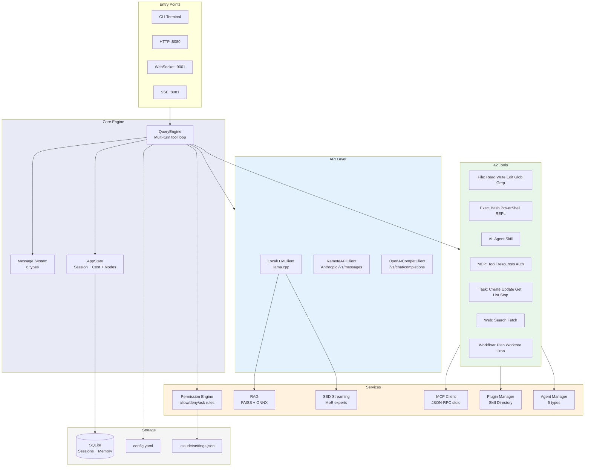

---

## 2. Request Processing Flow

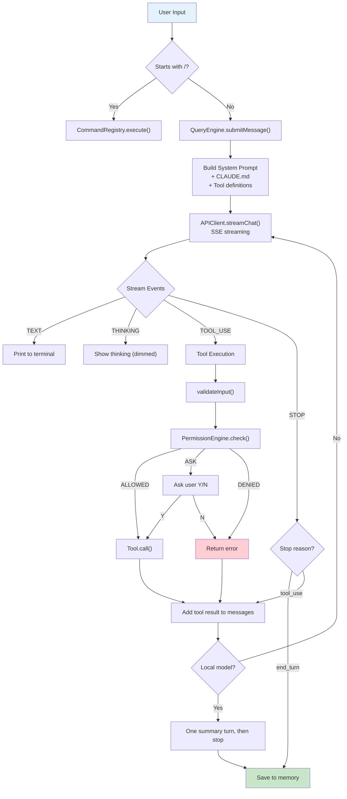

---

## 3. API Client Selection

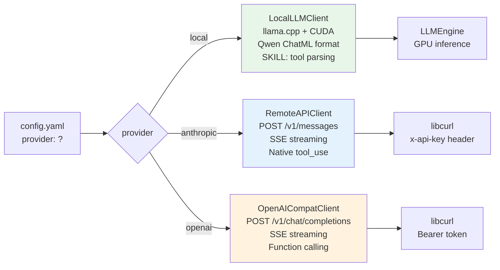

---

## 4. Configuration Priority

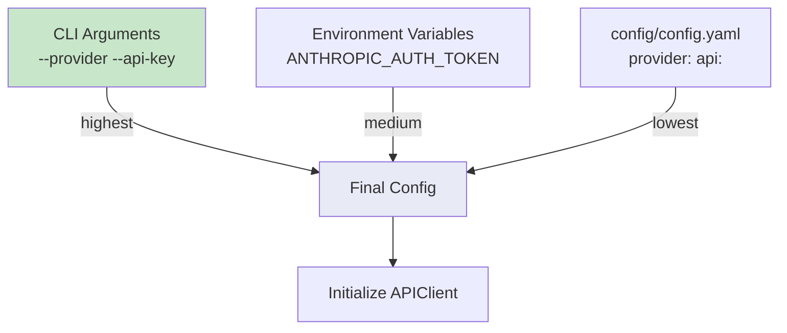

---

## 5. Permission System

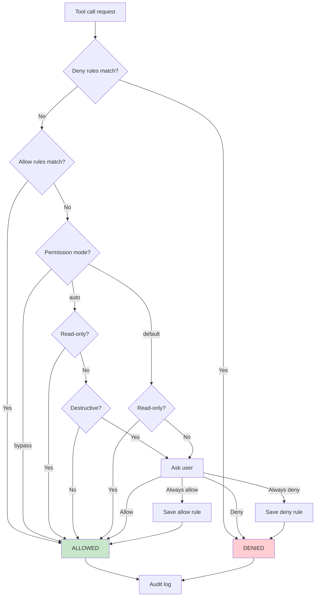

---

## 6. Multi-Agent System

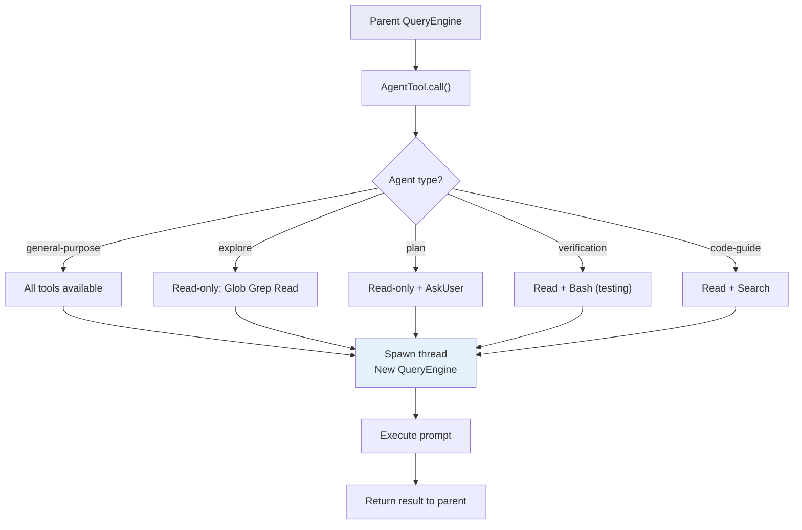

---

## 7. MCP Protocol

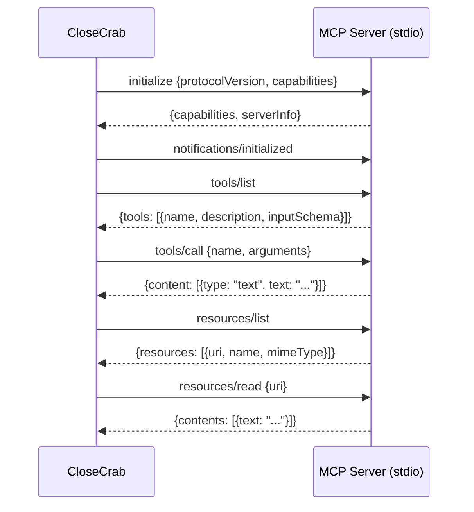

---

## 8. RAG Pipeline

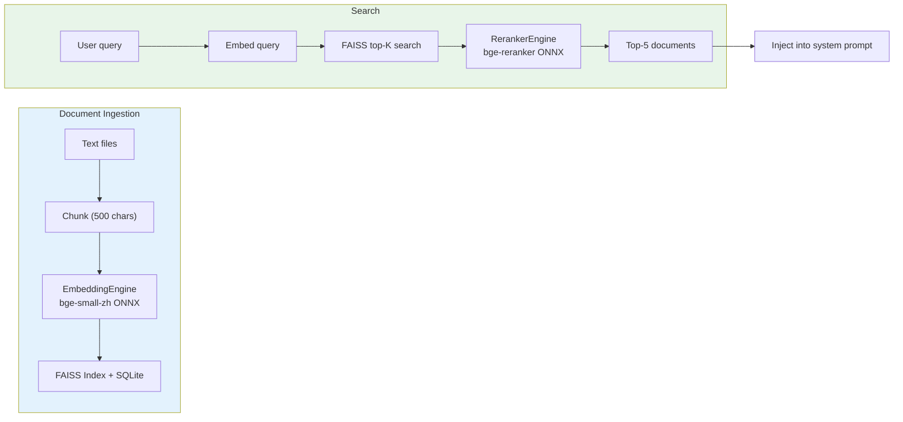

---

## 9. SSD Expert Streaming (MoE)

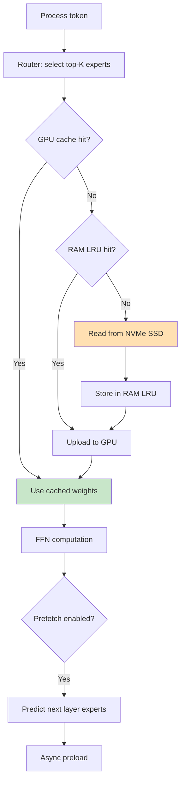

---

## 10. Module Dependency Graph

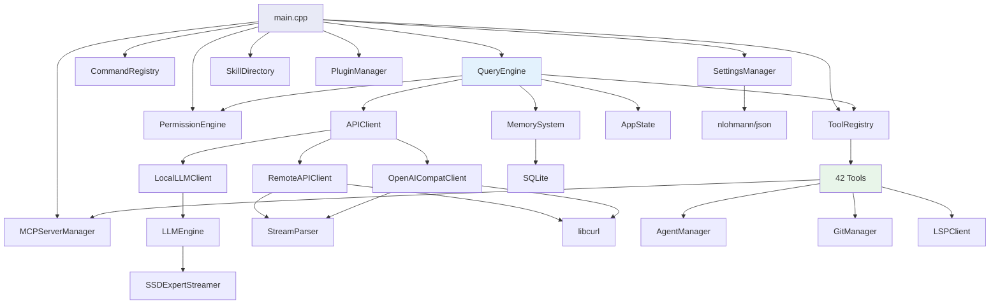

---

## 11. Tool Execution Detail

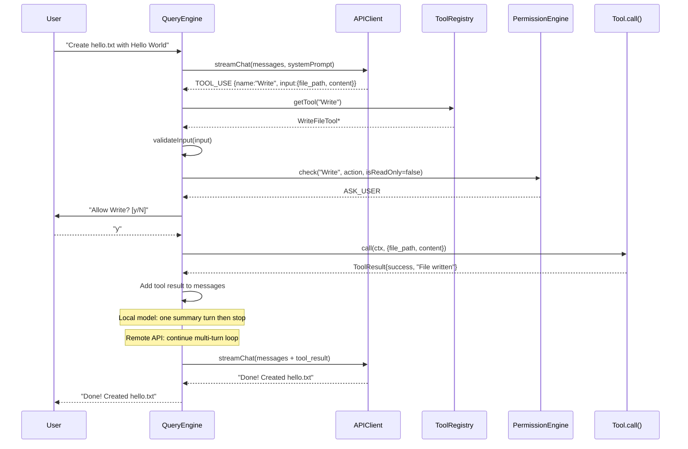

---

## 12. Streaming Architecture

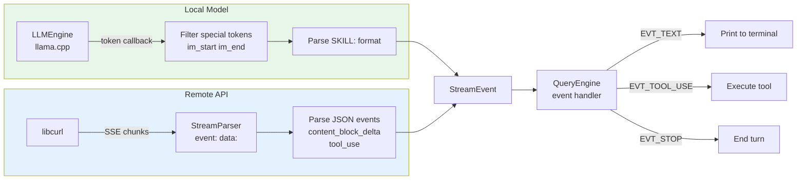

---

## 13. File Structure

```
CloseCrab-Unified/
├── src/
│   ├── main.cpp                    # Entry, init, main loop
│   ├── core/
│   │   ├── QueryEngine.h/.cpp      # Core: multi-turn tool loop
│   │   ├── Message.h/.cpp          # 6 message types
│   │   ├── AppState.h              # Global state
│   │   └── CostTracker.h           # Token cost tracking
│   ├── api/
│   │   ├── APIClient.h             # Abstract interface
│   │   ├── LocalLLMClient.h/.cpp   # llama.cpp wrapper
│   │   ├── RemoteAPIClient.h/.cpp  # Anthropic API
│   │   ├── OpenAICompatClient.h/.cpp # OpenAI format
│   │   └── StreamParser.h/.cpp     # SSE parser
│   ├── tools/                      # 42 tools (header-only)
│   ├── commands/                   # 36 commands
│   ├── agents/AgentManager.h/.cpp  # 5 agent types
│   ├── mcp/MCPClient.h/.cpp        # MCP JSON-RPC client
│   ├── plugins/PluginManager.h     # Plugin + skill loader
│   ├── permissions/PermissionEngine.h/.cpp
│   ├── rag/                        # FAISS + ONNX
│   ├── ssd/SSDExpertStreamer.h/.cpp # MoE streaming
│   ├── llm/LLMEngine.h/.cpp        # llama.cpp engine
│   ├── network/                    # HTTP, WS, SSE servers
│   ├── git/GitManager.h            # Git CLI wrapper
│   ├── lsp/LSPClient.h/.cpp        # LSP protocol
│   ├── bridge/BridgeClient.h/.cpp  # Remote execution (HTTP + reconnect)
│   ├── voice/VoiceEngine.h         # Voice TTS (SAPI/say/espeak)
│   ├── coordinator/Coordinator.h   # Multi-agent task decomposition
│   ├── hooks/HookManager.h         # PreToolUse/PostToolUse event hooks
│   ├── ui/TerminalUI.h             # Spinner, Markdown renderer, Table formatter
│   ├── ui/VimMode.h                # Vim Normal/Insert/Command modes
│   └── utils/ProcessRunner.h       # Cross-platform process execution
├── config/config.yaml              # Main configuration
├── installer.iss                   # Inno Setup installer
├── run.bat                         # Launch script
├── download_model.bat              # Model downloader
├── icons/                          # App icons
└── docs/                           # Documentation
```

---

## 14. New Components (v0.2.0)

### 14.1 HistoryCompactor

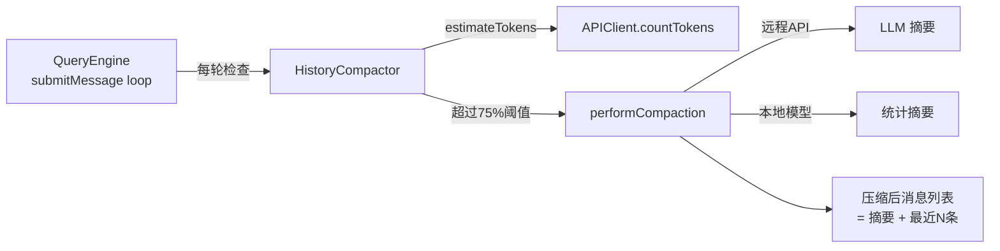

- 自动触发：每轮 API 调用前检查 token 总量
- 阈值：`maxContextTokens * 0.75`（默认 128k * 0.75 = 96k）
- 保留最近 10 条消息，旧消息压缩为 1 条 SYSTEM 摘要
- 不会在 tool_use/tool_result 对中间切割

### 14.2 HookManager

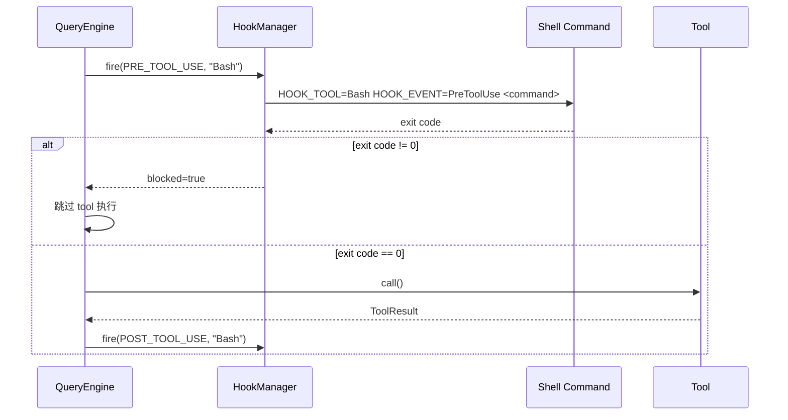

### 14.3 Coordinator

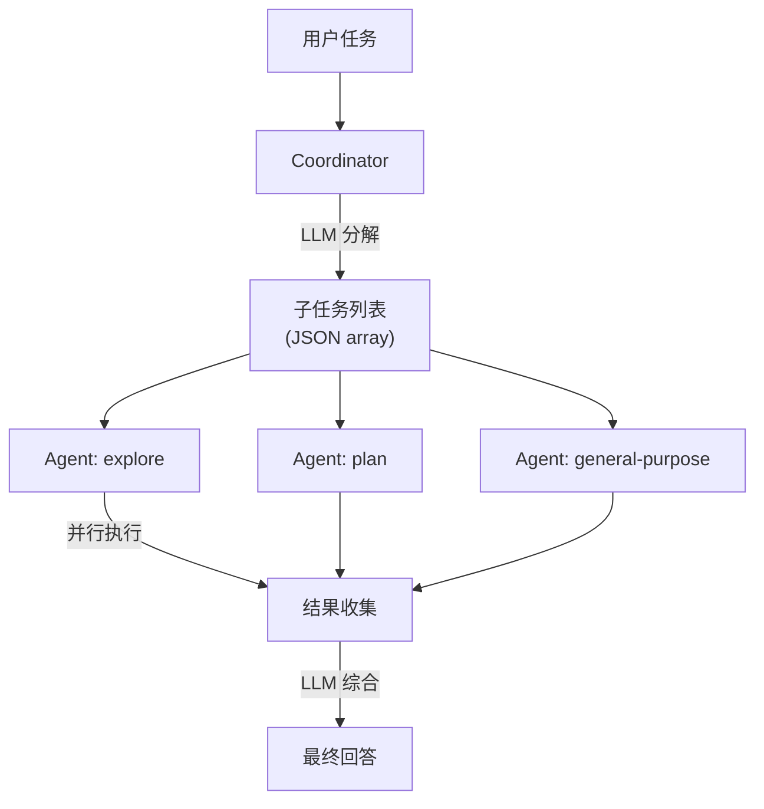

### 14.4 FileMemoryManager

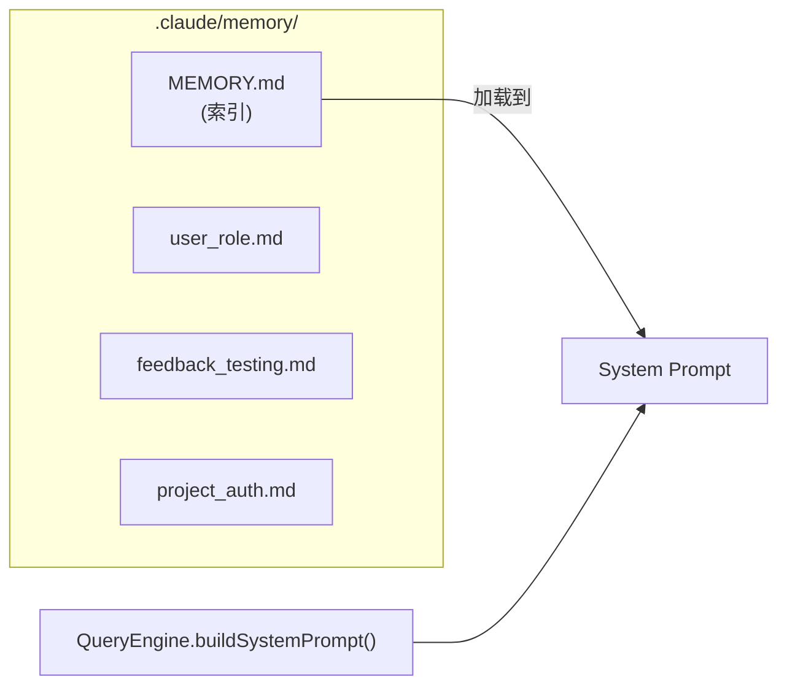

每个 .md 文件包含 YAML frontmatter（name, description, type）+ 正文内容。

### 14.5 ProcessSandbox

```
Windows:
  CreateJobObject → SetInformationJobObject(内存/CPU限制) → AssignProcessToJobObject

Linux:
  fork → setrlimit(RLIMIT_AS, RLIMIT_CPU, RLIMIT_FSIZE) → exec
```

### 14.6 Terminal UI 组件

| 组件 | 文件 | 功能 |
|------|------|------|
| Spinner | ui/TerminalUI.h | Tool 执行时旋转动画 |
| MarkdownRenderer | ui/TerminalUI.h | 代码块/标题/粗体 ANSI 着色 |
| TableFormatter | ui/TerminalUI.h | /status, /cost 对齐表格 |
| InputHistory | ui/TerminalUI.h | 输入历史记录 |
| VimInput | ui/VimMode.h | Normal/Insert/Command 模式切换 |

### 14.7 API Error & Retry

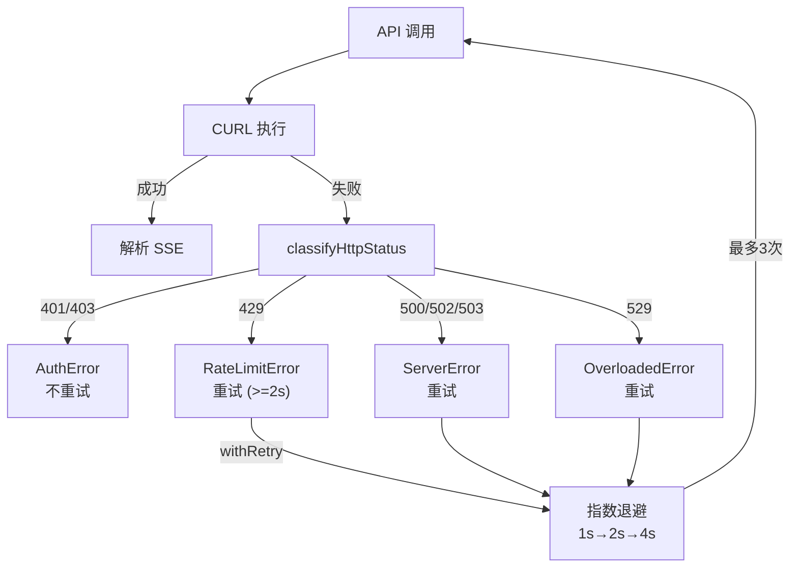
